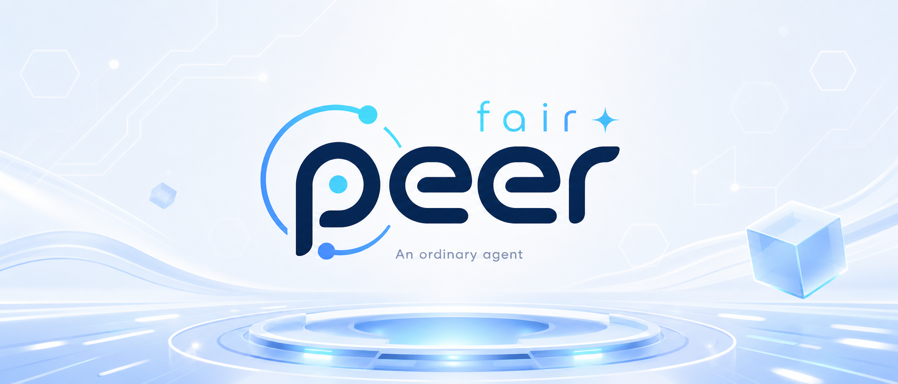

<p align="center">
  
</p>

<p align="center">
  <strong>linkpeer · 简体中文</strong>
  &nbsp;·&nbsp;
  <a href="./README.md">fairpeer 桌面端</a>
  &nbsp;·&nbsp;
  <a href="./docs/MOBILE_CLIENT_PLAN.md">技术方案</a>
</p>

<p align="center">
  
  
  
  
  
</p>

<br/>

<h3 align="center">把你的 AI 工作站，装进口袋。</h3>
<p align="center">
  linkpeer 是 <a href="./README.md">fairpeer</a> 的移动伴侣端 —— 一个 Android / iOS 瘦客户端，<br/>
  让你在手机上实时看到桌面端 fairpeer 正在做什么，并远程下达指令。
</p>

<br/>

## linkpeer 是什么

linkpeer 让你**离开键盘之后，依然掌控那台在桌面跑着的 fairpeer**。

桌面 fairpeer 负责重活：跑模型、读写工程文件、做 Word/Excel/PPT 办公自动化。linkpeer 是它的一面**镜子**和一个**遥控器**：

- **镜子**：实时镜像桌面端当前的对话流——模型正在思考、调了哪个工具、改了哪些文件，你手机上一目了然。
- **遥控器**：在手机上发指令、追问、批准高危操作、触发办公任务；这些指令端到端加密、点对点直达你的桌面。

**linkpeer 自己不跑模型、不存你的 API Key、不复制你的文件。** 它不是「另一个 AI 助手」，而是桌面端 fairpeer 的延伸——你的算力、你的数据、你的密钥，始终留在你自己那台桌面机上。

## 为什么需要 linkpeer

- 🚇 **通勤路上**：出门前让 fairpeer 跑一个长任务（重构、批量文档处理），地铁上打开手机看进度、在关键步骤弹审批时点一下「允许」。
- 🛏️ **睡前/休息**：躺在床上回看白天某个会话，顺手追问一句、或把它导出成文档。
- 🧑‍💼 **开会中**：手机远程触发桌面 fairpeer「按模板生成一份周报 Word」/「把这周 Excel 数据整理一下」，开完会回工位结果已经躺着。
- 🖥️ **多设备**：公司电脑一台 fairpeer、家里电脑一台 fairpeer，手机 linkpeer 统一管理、随时切看哪台。
- 📷 **拍照即问**：手机拍下题目/文档/报错截图，投给桌面 fairpeer（带屏幕解题能力的那个）处理，结果回手机。
- 🔒 **数据不出桌**：你信任的是你自己那台桌面机的文件系统和 Key，linkpeer 只看、只遥控，不留副本——既比「把文件传到手机端 AI」安全，也比「云端 Agent」省心。

## 核心功能

- 📱 **实时对话镜像** —— 桌面端 fairpeer 的每一条事件流（思考、文本、工具调用、diff、token 用量）原样同步到手机，与桌面 webview 看到的一模一样。
- 🚦 **远程批操作** —— 模型要执行高危工具（改文件、跑命令）时弹审批，手机一键允许/拒绝；也可暂停、取消、追问、切计划模式。等价于坐在桌面前点鼠标。
- 📄 **移动办公触发** —— 在手机上选择 Word/Excel/PPT 模板、填参数、点执行；桌面 fairpeer 跑完后结果回传预览。文档始终留在桌面文件系统，手机不留副本。
- 🔒 **端到端加密直连** —— 手机与桌面点对点（P2P）WebRTC 连接，应用层 AES-256-GCM 加密；**业务流量绝不经过任何云服务器**。
- 🏠 **局域网零依赖** —— 手机和电脑在同一 WiFi 时，直接内网直连，不碰任何云、不打洞、零配置。
- 📡 **多桌面端管理** —— 一部手机可绑定多台 fairpeer 桌面（公司 + 家里），随时切换查看。
- 🌗 **原生跨平台** —— 一套 Flutter 代码出 Android + iOS，遵循各自平台规范（Keychain / Keystore、前台服务 / 后台规范）。
- 🛡️ **权限分级** —— 桌面端可对每台手机设「只读」「操作需批准」「禁用高危工具」三档权限，完全可控。

## linkpeer 与 fairpeer 怎么配合

| | fairpeer（桌面） | linkpeer（移动） |
|---|---|---|
| 角色 | 服务 peer | 连接 peer |
| 跑模型 | ✅ | ❌ |
| 持有 API Key | ✅ | ❌ |
| 访问文件系统 | ✅ | ❌（只发指令、看结果） |
| 持有会话历史 | ✅（本地 JSONL） | 仅缓存镜像 |
| 平台 | Windows / macOS / Linux | Android / iOS |
| 技术栈 | Go + Wails | Flutter |

```
                ┌──────────────────┐
                │  云端信令（仅敲门）│  配对码 / 公钥指纹 / ICE 候选
                └─────────┬────────┘
                          │ 敲门
        ┌─────────────────┴──────────────────┐
        ▼                                     ▼
┌────────────────┐   WebRTC P2P（E2E 加密）   ┌────────────────┐
│   fairpeer     │ ◄══════════════════════► │   linkpeer     │
│   桌面服务端   │   下行：对话事件流         │   手机瘦客户端 │
│                │   上行：命令 / 审批        │                │
└────────────────┘                           └────────────────┘
```

linkpeer 在 fairpeer 内部的角色，等同于已经存在的飞书 / QQ / Telegram / 微信 bot 适配器——「第 5 个 bot 适配器」，但语义是「远程镜像」而非「IM 出站」。所以 fairpeer 的核心逻辑零改动。

## 安全与隐私（承诺）

linkpeer 的设计原则是 **「不信任云端、不信任网络，只信任配对时本地校验过的那把公钥」**：

1. **业务流量永不过云** —— 手机和桌面之间是 WebRTC P2P 直连。云端信令服务器**只做敲门**（配对撮合、交换候选地址），看不到任何对话内容、命令、文件。
2. **端到端加密** —— 即使 P2P 链路被窃听，应用层 AES-256-GCM 加密让攻击者只看到密文。会话密钥每次连接临时派生（X25519 ECDH），断开即弃。
3. **密钥本地存储** —— 设备长期身份密钥（Ed25519）存在桌面 `secret.Store`（Windows 用 DPAPI 加密）和手机 Keychain/Keystore，永不上传。
4. **扫码防中间人** —— 配对时桌面显示二维码含公钥指纹，手机扫码后**本地比对**指纹，云端传回的公钥不被直接信任。
5. **桌面端说了算** —— 手机能做什么，完全由桌面端授权：只读、需批准、禁高危工具，三档可逐设备配置。
6. **最恶劣场景也不泄密** —— 即便云服务器被攻破，攻击者拿到的也只有加密字节和敲门信令。

## 跨平台能力与限制

### Android

- ✅ 前台服务（带常驻通知）维持 P2P 连接，Doze 模式下不轻易断
- ✅ Keystore 存设备私钥
- ✅ 自签名 APK 可侧载；也会上 Google Play
- ⚠️ 后台耗电与保活需用户授权前台服务

### iOS

- ✅ Keychain 存设备私钥
- ✅ 端到端加密合规（`ITSAppUsesNonExemptEncryption` 声明，免出口加密申报）
- ⚠️ **后台保活受限**：iOS 后台会挂起网络 socket。**MVP 策略为仅前台运行**（切后台暂停接收，回前台后自动拉取增量）；后台推送（APNs 静默唤醒）作为后期可选增强，需过 App Store 审核。
- ✅ 上架 App Store

## 快速开始

> ⚠️ linkpeer 当前处于 **规划阶段（M0 未启动）**，以下为目标使用流程，尚未实现。

1. **桌面端**：打开 fairpeer → 设置 → 移动端 → 点「配对新设备」，屏幕出现二维码 + 6 位配对码。
2. **手机**：安装 linkpeer → 首次打开 → 扫描桌面二维码 → 确认指纹一致 → 完成绑定。
3. 此后手机 App 自动连接桌面 fairpeer，实时镜像对话、可下发命令。
4. 同一 WiFi 下自动走内网直连（零延迟、零云依赖）；跨网时自动 STUN 打洞；打不通时提示切换网络。

## 技术架构

linkpeer 与 fairpeer 桌面端通过单条 WebRTC DataChannel 通信，协议为 NDJSON：

- **下行**：复用桌面端 fairpeer 现有的事件流契约（`wireEvent`），手机拿到的就是 webview 在渲染的同一条流。
- **上行**：命令消息（`submit` / `cancel` / `approve` / `answer` / `office_run` …）直接映射到桌面端已有的多 tab 方法，桌面端桥接器纯转发，零业务逻辑新增。

完整协议、信令服务 API、打洞策略、安全模型、双端改动清单见 **[技术方案文档](./docs/MOBILE_CLIENT_PLAN.md)**。

桌面端桥接代码位于 fairpeer 仓库的 `internal/mobilebridge/`；linkpeer 移动端为独立 Flutter 仓库。

## 状态与路线图

| 阶段 | 目标 |
|---|---|
| M0 | 云端信令服务（配对码、候选中转） |
| M1 | fairpeer 桌面桥接器（`internal/mobilebridge`） |
| M2 | 同 WiFi 下 P2P + 端到端加密打通 |
| M3 | 跨网打洞（STUN / UPnP） |
| M4 | linkpeer 对话界面 |
| M5 | linkpeer 办公界面 |
| M6 | Android + iOS 双端上架打磨 |

详细计划见 [技术方案文档第 10 节](./docs/MOBILE_CLIENT_PLAN.md#10-路线图)。

## FAQ

**Q：为什么有时候连不上？**
A：默认仍是 P2P 优先（ICE 候选直连 > 中转）。当手机和桌面**双方都处在对称 NAT**（移动 4G / 运营商 CGNAT 家宽常见）时，NAT 物理上打不通，此时走可选的 TURN 中转兜底（桌面端「公网跳板」开关 + 自建 coturn，见 fairpeer-vps 项目）。**中继只转发 DTLS 加密包，服务器无法解密业务流量**——底线从「绝不过云」演进为「云不可解密」；不接受中转可关闭（回到纯 P2P，双对称 NAT 场景需：① 两端同 WiFi；② 桌面配公网 IP / UPnP；③ 换网络）。

**Q：云服务器能看到我的对话吗？**
A：不能。云端只搬「敲门」信号（配对码、公钥指纹、ICE 候选地址），看不到对话、命令、文件；且这些业务流量本身也是端到端加密的。

**Q：手机在后台能收到通知吗（比如审批请求）？**
A：Android 可以（前台服务常驻）。iOS 因系统限制，MVP 版本仅在前台实时推送；后台通知（APNs 唤醒）在后期版本加入。

**Q：Windows 桌面 + iPhone 能用吗？**
A：能。linkpeer 跨 Android / iOS，fairpeer 跨 Windows / macOS / Linux，任意组合。

**Q：能不用云端信令吗？**
A：同 WiFi 场景下可以——两端在同一局域网时直接 host candidate 直连，不碰任何云。云端信令只在跨网打洞时做敲门用。

**Q：一部手机能连多台电脑吗？**
A：可以。linkpeer 支持「一对多」绑定，每台桌面 fairpeer 是独立的服务 peer。

**Q：linkpeer 会把我的文件复制到手机吗？**
A：不会。文件始终留在桌面文件系统，linkpeer 只发送指令（如「编辑这个文件」「生成这份 Word」）和接收结果预览。

## 相关文档

- [fairpeer 桌面端](./README.md) —— 主产品
- [技术方案（决策锁定版）](./docs/MOBILE_CLIENT_PLAN.md) —— 完整架构、协议、安全模型、双端改动清单、路线图
- [fairpeer 中文介绍](./README_cn.md)

## 许可证

同 fairpeer 主仓库，见 [LICENSE](./LICENSE)。
